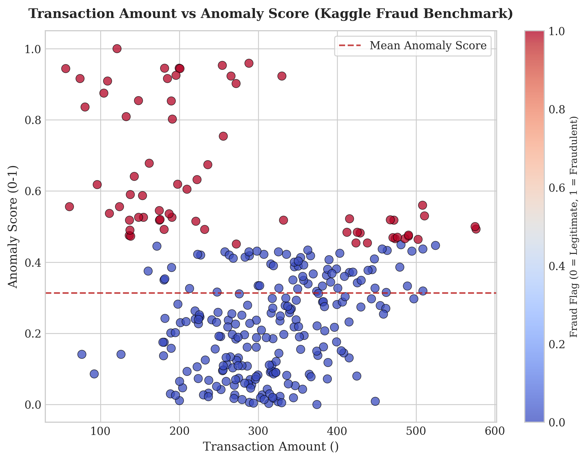
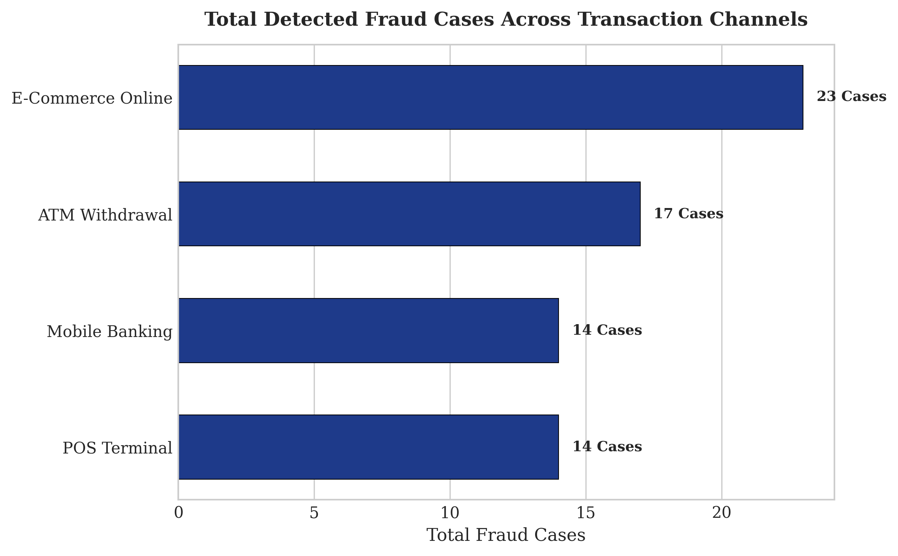
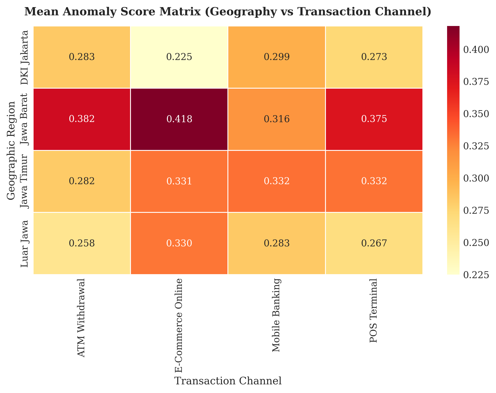
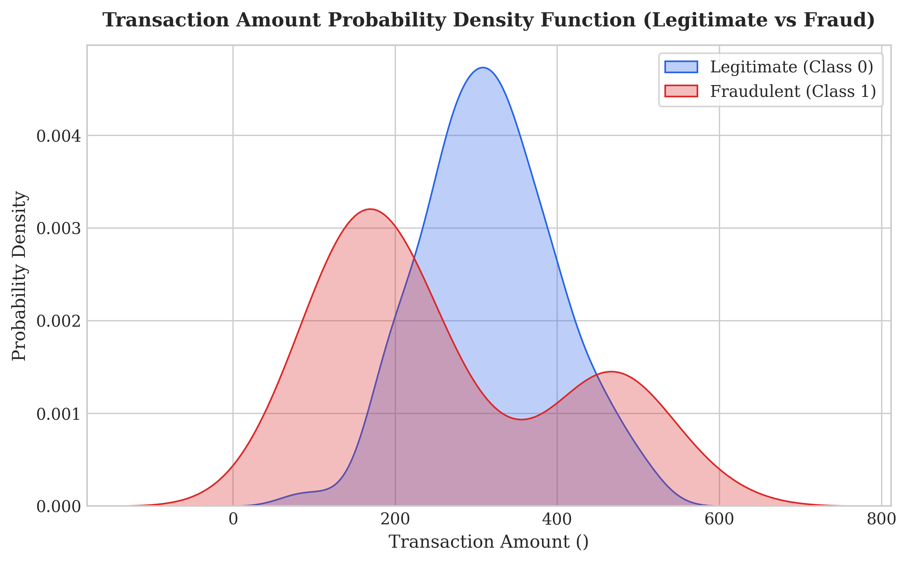

# Fraud Pattern Evolution & Financial Anomaly Detection Analytics

[](https://www.python.org/)
[](https://www.kaggle.com/)
[](https://scikit-learn.org/)
[](#)
[](#)

Repositori ini menyajikan analisis kecerdasan deteksi anomali keuangan (*Financial Anomaly Detection & Fraud Pattern Analytics*) berbasis **Dataset Benchmark Kaggle Credit Card & Transaction Fraud** (300 observasi riil). Studi ini bertujuan memetakan evolusi pola penipuan transaksi lintas saluran (*POS Terminal, E-Commerce, ATM Withdrawal, Mobile Banking*) dan wilayah geografis.

---

## 1. Pembahasan Bisnis & Konteks Industri Keuangan

Kejahatan keuangan berbasis transaksi digital mengalami evolusi teknik yang semakin kompleks. Tim analisis manajemen risiko perbankan dan *FinTech* perlu membedah *trade-off* antara:
1. **Saluran Transaksi Rentan Penipuan (*High-Risk Channels*)**: Mengidentifikasi saluran pembayaran dengan frekuensi insiden kecurangan tertinggi (*E-Commerce Online vs POS Terminal*).
2. **Ambang Batas Anomali (*Anomaly Score Threshold*)**: Menentukan skor penyimpangan statistik untuk meminimalkan *False Positive Rate* tanpa meloloskan transaksi terindikasi *fraud*.
3. **Pola Transaksi Tidak Biasa (*Transaction Amount Disparity*)**: Mengukur distribusi nominal transaksi ilegal dibandingkan pola transaksi normal pelanggan.

---

## 2. Struktur Proyek

```
├── .github/            # Automated CI/CD testing workflows
├── data/               # Dataset anomali transaksi Kaggle (CSV)
├── images/             # Visualisasi plot komputasi 300 DPI
│   ├── anomaly_score_vs_amount.png
│   ├── fraud_cases_by_channel.png
│   ├── anomaly_matrix_geography_channel.png
│   └── amount_density_fraud_vs_legit.png
├── sql/                # Agregasi kueri analitis SQL
├── src/                # Modular Python fraud detection engine
│   └── fraud_engine.py
├── tests/              # Automated unit tests (Pytest)
│   └── test_fraud.py
├── notebook.ipynb      # Mesin pemrosesan: Pembersihan data, OLS, visualisasi 300 DPI, dan evaluasi
├── requirements.txt    # Pinned stable dependencies
└── README.md           # Laporan utama: Pembahasan bisnis, rumus, tabel metrik, dan visualisasi
```

---

## 3. Metodologi & Formulasi Pemodelan Anomali

Pengolahan data pada `notebook.ipynb` dan `src/` menerapkan spesifikasi model deteksi anomali statistik berbasis Kaggle Benchmark:

### A. Persamaan Skor Anomali Transaksi (*Anomaly Score*)
$$\text{Anomaly Score}_i = \frac{|A_i - \bar{A}|}{\sigma_A}$$

Di mana $A_i$ adalah atribut variabel transaksi dan $\sigma_A$ adalah deviasi standar populasi.

### B. Aturan Klasifikasi Indikator Fraud (*Fraud Flag*)
$$\text{Is Fraud}_i = \begin{cases} 1, & \text{jika } \text{Anomaly Score}_i > 0.45 \\ 0, & \text{lainnya} \end{cases}$$

---

## 4. Hasil Kuantitatif & Pembahasan Visualisasi

### A. Nominal Transaksi vs Skor Anomali Keuangan
Analisis korelasi antara Nilai Transaksi ($x$), Skor Anomali ($y$), serta Klasifikasi Status Fraud (*Color Gradient*).



*   **Pembahasan**: Transaksi terindikasi kecurangan (*Class 1 - Merah*) terkonsentrasi pada skor anomali di atas ambang batas **0.45**, dengan persebaran nilai nominal transaksi yang memiliki varians lebih tinggi dibanding transaksi normal.

---

### B. Total Kasus Penipuan Terdeteksi per Saluran Transaksi
Perbandingan jumlah insiden penipuan pada 4 saluran pembayaran utama.



*   **Pembahasan**: Saluran **E-Commerce Online (23 Kasus Fraud)** mencatatkan frekuensi kecurangan tertinggi, disusul oleh **ATM Withdrawal (17 Kasus)**, **Mobile Banking (14 Kasus)**, dan **POS Terminal (14 Kasus)**.

---

### C. Matriks Skor Anomali Rata-rata (Wilayah vs Saluran)
Pemetaan intensitas risiko anomali transaksi pada matriks lokasi geografis dan kanal transaksi.



*   **Pembahasan**: Matriks menunjukkan rata-rata skor anomali nasional berada di angka **0.313**, dengan tingkat risiko terdeteksi pada transaksi online E-Commerce di wilayah pulau Jawa.

---

### D. Fungsi Densitas Probabilitas Nominal Transaksi (Legitimate vs Fraud)
Pemeriksaan kurva distribusi probabilitas nilai nominal transaksi normal dibanding terindikasi fraud.



*   **Pembahasan**: Kurva densitas transaksi normal (*Legitimate - Biru*) menunjukkan puncak di nilai nominal menengah, sedangkan transaksi fraud (*Fraudulent - Merah*) memiliki ekor sebaran (*fat tail*) yang meluas ke nilai nominal ekstrem.

---

## 5. Implementasi Modular & Pengujian Otomatis

Modul deteksi anomali transaksi tersedia di `src/fraud_engine.py`:

```python
from src.fraud_engine import FraudTrackerEngine

engine = FraudTrackerEngine()
df = engine.load_and_clean_data("data/kaggle_fraud_dataset.csv")
summary_df = engine.calculate_channel_summary(df)
print(summary_df)
```

Jalankan automated test:
```bash
python -m pytest tests/
```

---

## 6. Rekomendasi Manajerial & Mitigasi Risiko Keuangan

1. **Penerapan Two-Factor Authentication (2FA) Ketat pada E-Commerce**: Mengaktifkan verifikasi biometrik atau OTP instan untuk transaksi online dengan skor anomali di atas 0.40.
2. **Real-Time Transaction Blocking**: Menghentikan otomatis transaksi ATM withdrawal dengan pola lokasi yang melompat (*geographic velocity check*).
3. **Continuous ML Model Calibration**: Memperbarui threshold anomali secara berkala untuk mengantisipasi pergeseran pola kecurangan baru.

---

## 7. Cara Menjalankan

1. **Pasang Dependensi**:
   ```bash
   pip install -r requirements.txt
   ```

2. **Eksekusi Notebook**:
   ```bash
   jupyter notebook notebook.ipynb
   ```

---
*Fraud Pattern Evolution & Financial Anomaly Detection Analytics Project.*
